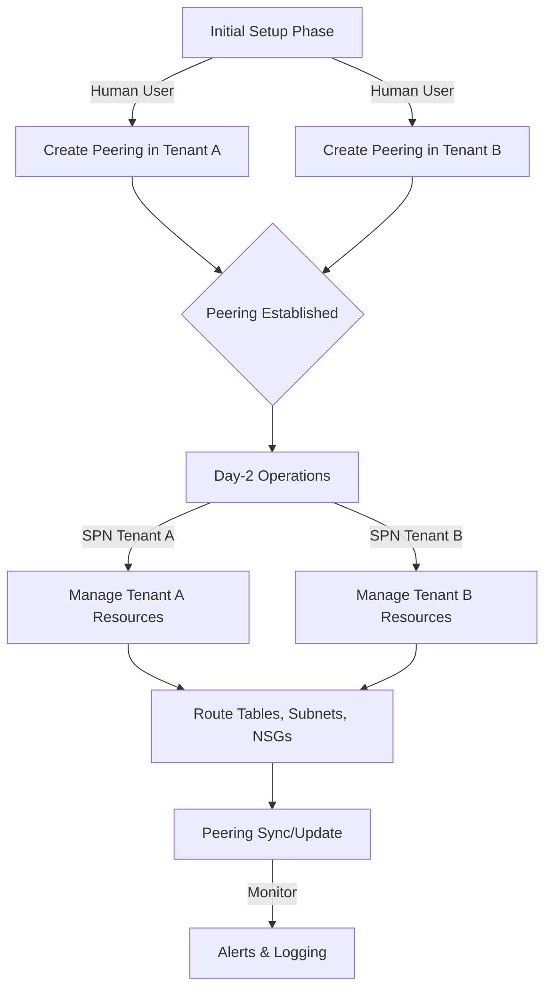

# Cross-Tenant VNet Peering Implementation Guide

## Executive Summary
This document provides a complete technical guide for implementing VNet peering between two Azure tenants using custom RBAC roles with least-privilege access. This approach enables secure, least-privilege cross-tenant networking without requiring Owner or Contributor roles.

## Table of Contents
1. [Overview](#overview)
2. [Prerequisites](#prerequisites)
3. [Custom RBAC Role Definition](#custom-rbac-role-definition)
4. [Implementation Steps](#implementation-steps)
5. [Verification](#verification)
6. [Troubleshooting](#troubleshooting)

---

## Overview

### What is Cross-Tenant VNet Peering?
Cross-tenant VNet peering allows Virtual Networks in different Azure AD tenants to communicate with each other. Unlike same-tenant peering, this requires:
- Separate authentication to each tenant
- Bidirectional peering creation (each tenant creates their side)
- Proper RBAC permissions on both sides

### Architecture
```
Tenant A (Organization A)                       Tenant B (Organization B)
Subscription: xxxxxxxx-xxxx-xxxx-xxxx-...       Subscription: yyyyyyyy-yyyy-yyyy-yyyy-...
├── Resource Group: rg-tenant-a                 ├── Resource Group: rg-tenant-b
    └── VNet: vnet-tenant-a                         └── VNet: vnet-tenant-b
        Address Space: 192.168.0.0/16                   Address Space: 10.0.0.0/16
        │                                               │
        └───────────── Peering Connection ─────────────┘
```

---

## Prerequisites

### 1. Network Requirements
- **Non-overlapping address spaces** between VNets
  - Example: VNet A: `192.168.0.0/16`, VNet B: `10.0.0.0/16`
- Both VNets must exist before creating peering

### 2. Access Requirements
- User account with access to both tenants
- Permission to create custom RBAC roles (or roles already created)
- Permission to assign RBAC roles at the resource group level

### 3. Tools Required
- Azure CLI installed and configured
- Web browser for interactive authentication

---

## Custom RBAC Role Definition

### Role Purpose
The custom role `vnet-peer` provides the **minimum required permissions** for VNet peering operations without granting excessive privileges like Owner or Contributor roles.

### Role Definition JSON

```json
{
  "properties": {
    "roleName": "vnet-peer",
    "description": "Allow VNet peering, sync and UDR changes on the scoped VNets.",
    "assignableScopes": [
      "/subscriptions/{SUBSCRIPTION_ID}/resourceGroups/{RESOURCE_GROUP_NAME}"
    ],
    "permissions": [
      {
        "actions": [
          "Microsoft.Network/virtualNetworks/read",
          "Microsoft.Network/virtualNetworks/write",
          "Microsoft.Network/virtualNetworks/subnets/read",
          "Microsoft.Network/virtualNetworks/subnets/write",
          "Microsoft.Network/virtualNetworks/virtualNetworkPeerings/read",
          "Microsoft.Network/virtualNetworks/virtualNetworkPeerings/write",
          "Microsoft.Network/virtualNetworks/virtualNetworkPeerings/delete",
          "Microsoft.Network/virtualNetworks/peer/action",
          "Microsoft.Network/routeTables/read",
          "Microsoft.Network/routeTables/write",
          "Microsoft.Network/routeTables/delete",
          "Microsoft.Network/routeTables/routes/read",
          "Microsoft.Network/routeTables/routes/write",
          "Microsoft.Network/routeTables/routes/delete",
          "Microsoft.Network/routeTables/join/action",
          "Microsoft.Network/networkSecurityGroups/read",
          "Microsoft.Network/networkSecurityGroups/join/action"
        ],
        "notActions": [],
        "dataActions": [],
        "notDataActions": []
      }
    ]
  }
}
```

### Permission Breakdown

| Permission | Purpose |
|------------|---------|
| `Microsoft.Network/virtualNetworks/read` | Read VNet configuration |
| `Microsoft.Network/virtualNetworks/write` | Modify VNet settings |
| `Microsoft.Network/virtualNetworks/subnets/*` | Manage subnets |
| `Microsoft.Network/virtualNetworks/virtualNetworkPeerings/*` | Create, read, update, delete peerings |
| `Microsoft.Network/virtualNetworks/peer/action` | **Critical**: Authorize cross-tenant peering |
| `Microsoft.Network/routeTables/*` | Manage User Defined Routes (UDR) |
| `Microsoft.Network/routeTables/join/action` | Associate route tables with subnets |
| `Microsoft.Network/networkSecurityGroups/read` | Read Network Security Group configurations |
| `Microsoft.Network/networkSecurityGroups/join/action` | Associate NSG with subnets (required for subnet updates) |

---

## Implementation Steps

### Step 1: Create Custom RBAC Role in Both Tenants

#### Tenant A

1. Save the role definition to `vnet-peer-role.json` and update the `assignableScopes`:
```json
"assignableScopes": [
  "/subscriptions/{SUBSCRIPTION_A_ID}/resourceGroups/{RESOURCE_GROUP_A}"
]
```

2. Login to Tenant A:
```bash
az login --tenant {TENANT_A_ID}
az account set --subscription {SUBSCRIPTION_A_ID}
```

3. Create the custom role:
```bash
az role definition create --role-definition vnet-peer-role.json
```

4. Assign the role to the user:
```bash
az role assignment create \
  --assignee {USER_EMAIL_OR_OBJECT_ID} \
  --role "vnet-peer" \
  --scope "/subscriptions/{SUBSCRIPTION_A_ID}/resourceGroups/{RESOURCE_GROUP_A}"
```

#### Tenant B

Repeat the same process for Tenant B with its subscription and resource group:

```bash
# Login to Tenant B
az login --tenant {TENANT_B_ID}
az account set --subscription {SUBSCRIPTION_B_ID}

# Update assignableScopes in vnet-peer-role.json
"assignableScopes": [
  "/subscriptions/{SUBSCRIPTION_B_ID}/resourceGroups/{RESOURCE_GROUP_B}"
]

# Create role
az role definition create --role-definition vnet-peer-role.json

# Assign role
az role assignment create \
  --assignee {USER_EMAIL_OR_OBJECT_ID} \
  --role "vnet-peer" \
  --scope "/subscriptions/{SUBSCRIPTION_B_ID}/resourceGroups/{RESOURCE_GROUP_B}"
```

### Step 2: Gather VNet Information

Before creating peerings, collect the following information:

#### Tenant A Information:
```bash
az login --tenant {TENANT_A_ID}
az account set --subscription {SUBSCRIPTION_A_ID}

# Get VNet details
az network vnet show \
  --resource-group {RESOURCE_GROUP_A} \
  --name {VNET_A_NAME} \
  --query '{name:name, id:id, addressSpace:addressSpace}' \
  --output json
```

**Example Output:**
```json
{
  "addressSpace": {
    "addressPrefixes": ["192.168.0.0/16"]
  },
  "id": "/subscriptions/{SUBSCRIPTION_A_ID}/resourceGroups/{RESOURCE_GROUP_A}/providers/Microsoft.Network/virtualNetworks/{VNET_A_NAME}",
  "name": "vnet-tenant-a"
}
```

#### Tenant B Information:
```bash
az login --tenant {TENANT_B_ID}
az account set --subscription {SUBSCRIPTION_B_ID}

# Get VNet details
az network vnet show \
  --resource-group {RESOURCE_GROUP_B} \
  --name {VNET_B_NAME} \
  --query '{name:name, id:id, addressSpace:addressSpace}' \
  --output json
```

**Example Output:**
```json
{
  "addressSpace": {
    "addressPrefixes": ["10.0.0.0/16"]
  },
  "id": "/subscriptions/{SUBSCRIPTION_B_ID}/resourceGroups/{RESOURCE_GROUP_B}/providers/Microsoft.Network/virtualNetworks/{VNET_B_NAME}",
  "name": "vnet-tenant-b"
}
```

**⚠️ Important:** Verify that address spaces do not overlap!

### Step 3: Create Peering from Tenant A to Tenant B

```bash
# Login to Tenant A
az login --tenant {TENANT_A_ID}
az account set --subscription {SUBSCRIPTION_A_ID}

# Create peering
az network vnet peering create \
  --name peer-tenantA-to-tenantB \
  --resource-group {RESOURCE_GROUP_A} \
  --vnet-name {VNET_A_NAME} \
  --remote-vnet /subscriptions/{SUBSCRIPTION_B_ID}/resourceGroups/{RESOURCE_GROUP_B}/providers/Microsoft.Network/virtualNetworks/{VNET_B_NAME} \
  --allow-vnet-access
```

**Expected Result:**
```json
{
  "peeringState": "Connected",
  "peeringSyncLevel": "FullyInSync",
  "provisioningState": "Succeeded"
}
```

### Step 4: Create Peering from Tenant B to Tenant A

```bash
# Login to Tenant B
az login --tenant {TENANT_B_ID}
az account set --subscription {SUBSCRIPTION_B_ID}

# Create peering
az network vnet peering create \
  --name peer-tenantB-to-tenantA \
  --resource-group {RESOURCE_GROUP_B} \
  --vnet-name {VNET_B_NAME} \
  --remote-vnet /subscriptions/{SUBSCRIPTION_A_ID}/resourceGroups/{RESOURCE_GROUP_A}/providers/Microsoft.Network/virtualNetworks/{VNET_A_NAME} \
  --allow-vnet-access
```

**Expected Result:**
```json
{
  "peeringState": "Connected",
  "peeringSyncLevel": "FullyInSync",
  "provisioningState": "Succeeded"
}
```

---

## Verification

### Verify Peering Status

#### Check Tenant A:
```bash
az account set --subscription {SUBSCRIPTION_A_ID}

az network vnet peering list \
  --resource-group {RESOURCE_GROUP_A} \
  --vnet-name {VNET_A_NAME} \
  --query '[].{Name:name, PeeringState:peeringState, SyncLevel:peeringSyncLevel}' \
  --output table
```

**Expected Output:**
```
Name                     PeeringState    SyncLevel
-----------------------  --------------  -----------
peer-tenantA-to-tenantB  Connected       FullyInSync
```

#### Check Tenant B:
```bash
az account set --subscription {SUBSCRIPTION_B_ID}

az network vnet peering list \
  --resource-group {RESOURCE_GROUP_B} \
  --vnet-name {VNET_B_NAME} \
  --query '[].{Name:name, PeeringState:peeringState, SyncLevel:peeringSyncLevel}' \
  --output table
```

**Expected Output:**
```
Name                     PeeringState    SyncLevel
-----------------------  --------------  -----------
peer-tenantB-to-tenantA  Connected       FullyInSync
```

### Verify Custom Role Usage

#### Verify Role Assignments:
```bash
# Check Tenant A
az account set --subscription {SUBSCRIPTION_A_ID}
az role definition list --name vnet-peer --query "[0].{Name:roleName, Type:roleType}"

# Check Tenant B
az account set --subscription {SUBSCRIPTION_B_ID}
az role definition list --name vnet-peer --query "[0].{Name:roleName, Type:roleType}"
```

**Expected Output (both tenants):**
```json
{
  "Name": "vnet-peer",
  "Type": "CustomRole"
}
```

#### Verify No Owner Role:
```bash
# Check for Owner assignments on Tenant A
az role assignment list \
  --scope /subscriptions/{SUBSCRIPTION_A_ID}/resourceGroups/{RESOURCE_GROUP_A} \
  --query "[?roleDefinitionName=='Owner']" \
  --output table

# Check for Owner assignments on Tenant B
az role assignment list \
  --resource-group {RESOURCE_GROUP_B} \
  --query "[?roleDefinitionName=='Owner']" \
  --output table
```

**Expected Output:** Empty (no Owner assignments)

### Test Connectivity

Deploy test VMs in each VNet and verify connectivity:

```bash
# From VM in Tenant A (192.168.x.x)
ping 10.0.1.4  # IP of VM in Tenant B

# From VM in Tenant B (10.0.x.x)
ping 192.168.1.4  # IP of VM in Tenant A
```

---

## Troubleshooting

### Common Issues

#### 1. Peering State: "Initiated" or "RemoteNotInSync"
**Cause:** Only one side of the peering has been created.

**Solution:** Create the peering from the other tenant. Both sides must exist.

#### 2. Error: "Subscription not found"
**Cause:** You're trying to create peering to a remote subscription you're not authenticated to.

**Solution:** This is expected for cross-tenant peering. You cannot validate the remote subscription. Ensure you create the peering from both sides separately.

#### 3. Authentication/MFA Issues
**Cause:** Token expired or MFA required.

**Solution:** 
```bash
az login --scope https://management.core.windows.net//.default
```

#### 4. Permission Denied
**Cause:** Missing required permissions.

**Solution:** Verify the custom role is assigned:
```bash
az role assignment list \
  --assignee {USER_EMAIL} \
  --scope /subscriptions/{SUBSCRIPTION_ID}/resourceGroups/{RG_NAME}
```

#### 5. Address Space Overlap
**Cause:** VNets have overlapping IP ranges.

**Solution:** Modify VNet address spaces to be non-overlapping before creating peering.

---

## Optional: Advanced Peering Options

### Allow Forwarded Traffic
Allows traffic forwarded by a Network Virtual Appliance (NVA):
```bash
az network vnet peering create \
  --name {PEERING_NAME} \
  --resource-group {RG_NAME} \
  --vnet-name {VNET_NAME} \
  --remote-vnet {REMOTE_VNET_ID} \
  --allow-vnet-access \
  --allow-forwarded-traffic
```

### Gateway Transit
Allows one VNet to use the VPN gateway of the peered VNet:
```bash
# On the VNet WITH the gateway
az network vnet peering create \
  --allow-gateway-transit \
  # ... other parameters

# On the VNet WITHOUT the gateway
az network vnet peering create \
  --use-remote-gateways \
  # ... other parameters
```

**Note:** Only one side can enable gateway transit.

---

## Security Best Practices

1. **Least Privilege:** Use custom RBAC roles instead of Owner/Contributor
2. **Scope Limitation:** Limit role assignableScopes to specific resource groups
3. **Audit Logs:** Monitor activity logs for peering operations:
```bash
az monitor activity-log list \
  --resource-group {RG_NAME} \
  --query "[?contains(operationName.value, 'virtualNetworkPeerings')]"
```
4. **Network Security Groups (NSGs):** Apply NSGs to subnets to control traffic flow
5. **Private Link:** Consider Azure Private Link for service-level connectivity

---

## Automation with Service Principals

### Overview

Cross-tenant VNet peering automation requires careful consideration of Azure's authentication and authorization model. This section covers tested approaches for automating peering operations using Service Principals (SPNs).

### Key Findings from Testing

**What Service Principals CAN Do:**
- ✅ Read existing peering configurations
- ✅ Update peering settings (allow-forwarded-traffic, etc.)
- ✅ Sync peerings after address space changes
- ✅ Delete peerings
- ✅ Create, manage, and associate route tables (UDR)
- ✅ Manage subnets and NSG associations
- ✅ All operations **within their own tenant**

**What Service Principals CANNOT Do:**
- ❌ Create cross-tenant peerings directly
- ❌ Access resources in other tenants without explicit registration

**Reason:** Azure requires the Service Principal to be authorized in BOTH tenants for cross-tenant resource linking. When an SPN in Tenant A tries to create a peering to Tenant B, Azure validates that the SPN has permission to access the remote VNet, which fails with `LinkedAuthorizationFailed`.

### Automation Strategies

#### Option 1: Hybrid Approach (Recommended for Most Scenarios)

**Use Case:** Production environments where initial setup is manual, but ongoing management is automated.

**Approach:**
1. Initial peering creation: User account with `vnet-peer` role in both tenants
2. Day-2 operations: Service Principals manage, update, and maintain

**Advantages:**
- Simple setup, no multi-tenant app registration required
- SPNs can handle 99% of operational tasks
- Clear separation between setup and operations
- Works with existing security policies

**Implementation:**

```bash
# INITIAL SETUP (Human User)
# User must have vnet-peer role in both tenants

# 1. Login to Tenant A
az login --tenant {TENANT_A_ID}
az account set --subscription {SUBSCRIPTION_A_ID}

# 2. Create peering from Tenant A
az network vnet peering create \
  --name peer-a-to-b \
  --resource-group {RG_A} \
  --vnet-name {VNET_A} \
  --remote-vnet {VNET_B_ID} \
  --allow-vnet-access

# 3. Login to Tenant B
az login --tenant {TENANT_B_ID}
az account set --subscription {SUBSCRIPTION_B_ID}

# 4. Create peering from Tenant B
az network vnet peering create \
  --name peer-b-to-a \
  --resource-group {RG_B} \
  --vnet-name {VNET_B} \
  --remote-vnet {VNET_A_ID} \
  --allow-vnet-access

# DAY-2 OPERATIONS (Service Principal)
# SPNs can now manage the established peerings

# Tenant A SPN: Update peering settings
az login --service-principal \
  --username {SPN_A_APP_ID} \
  --password {SPN_A_PASSWORD} \
  --tenant {TENANT_A_ID}

az network vnet peering update \
  --name peer-a-to-b \
  --resource-group {RG_A} \
  --vnet-name {VNET_A} \
  --set allowForwardedTraffic=true

# Tenant A SPN: Create and manage route tables
az network route-table create \
  --name production-routes \
  --resource-group {RG_A}

az network route-table route create \
  --resource-group {RG_A} \
  --route-table-name production-routes \
  --name route-to-tenant-b \
  --address-prefix 10.0.0.0/16 \
  --next-hop-type VnetLocal

az network vnet subnet update \
  --resource-group {RG_A} \
  --vnet-name {VNET_A} \
  --name {SUBNET_NAME} \
  --route-table production-routes
```

#### Option 2: Multi-Tenant Application Registration

**Use Case:** Large-scale environments requiring full automation from start to finish.

**Approach:**
1. Register application as multi-tenant in Tenant A
2. Grant admin consent in Tenant B
3. Use the same SPN credentials to access both tenants

**Advantages:**
- Complete automation possible
- Single identity across tenants
- Suitable for enterprise-scale deployments

**Disadvantages:**
- Complex initial setup
- Requires admin consent in both tenants
- Security implications of cross-tenant access
- May conflict with security policies

**High-Level Steps:**

```bash
# 1. Register multi-tenant app in Tenant A
az ad app create \
  --display-name "VNet Peering Multi-Tenant App" \
  --sign-in-audience AzureADMultipleOrgs

# 2. Create service principal in Tenant A
az ad sp create --id {APP_ID}

# 3. Create secret
az ad app credential reset --id {APP_ID}

# 4. Assign role in Tenant A
az role assignment create \
  --assignee {APP_ID} \
  --role "vnet-peer" \
  --scope "/subscriptions/{SUB_A}/resourceGroups/{RG_A}"

# 5. Tenant B admin grants consent (Azure Portal or Admin Consent URL)
# URL: https://login.microsoftonline.com/{TENANT_B_ID}/oauth2/authorize?client_id={APP_ID}&response_type=code&redirect_uri=https://localhost

# 6. Create service principal in Tenant B
az login --tenant {TENANT_B_ID}
az ad sp create --id {APP_ID}

# 7. Assign role in Tenant B
az role assignment create \
  --assignee {APP_ID} \
  --role "vnet-peer" \
  --scope "/subscriptions/{SUB_B}/resourceGroups/{RG_B}"

# 8. Now the SPN can operate in both tenants
az login --service-principal \
  --username {APP_ID} \
  --password {SECRET} \
  --tenant {TENANT_A_ID}

# Can now create peerings
```

#### Option 3: Coordinated Service Principal Deployment

**Use Case:** CI/CD pipelines with access to both tenants through different credentials.

**Approach:**
1. Create separate SPN in each tenant
2. Orchestration pipeline has credentials for both SPNs
3. Pipeline coordinates peering creation from both sides simultaneously

**Advantages:**
- Each tenant maintains its own identity
- No cross-tenant authentication required
- Suitable for GitOps and Infrastructure-as-Code
- Clear audit trail per tenant

**Implementation Pattern:**

```yaml
# Example Azure DevOps Pipeline
stages:
  - stage: CreatePeering
    jobs:
      - job: TenantA
        pool:
          vmImage: 'ubuntu-latest'
        steps:
          - task: AzureCLI@2
            inputs:
              azureSubscription: 'TenantA-ServiceConnection'
              scriptType: 'bash'
              scriptLocation: 'inlineScript'
              inlineScript: |
                az network vnet peering create \
                  --name peer-a-to-b \
                  --resource-group $(RG_A) \
                  --vnet-name $(VNET_A) \
                  --remote-vnet $(VNET_B_ID) \
                  --allow-vnet-access
      
      - job: TenantB
        dependsOn: []  # Run in parallel
        pool:
          vmImage: 'ubuntu-latest'
        steps:
          - task: AzureCLI@2
            inputs:
              azureSubscription: 'TenantB-ServiceConnection'
              scriptType: 'bash'
              scriptLocation: 'inlineScript'
              inlineScript: |
                az network vnet peering create \
                  --name peer-b-to-a \
                  --resource-group $(RG_B) \
                  --vnet-name $(VNET_B) \
                  --remote-vnet $(VNET_A_ID) \
                  --allow-vnet-access
```

### Creating Service Principals with vnet-peer Role

#### Tenant A Service Principal Setup

```bash
# 1. Login to Tenant A as administrator
az login --tenant {TENANT_A_ID}
az account set --subscription {SUBSCRIPTION_A_ID}

# 2. Create Service Principal
az ad sp create-for-rbac \
  --name "vnet-peer-tenant-a-spn" \
  --skip-assignment

# Output will include:
# {
#   "appId": "xxxxxxxx-xxxx-xxxx-xxxx-xxxxxxxxxxxx",
#   "displayName": "vnet-peer-tenant-a-spn",
#   "password": "xxxxxxxxxxxxxxxxxxxxxxxxxxxx",
#   "tenant": "xxxxxxxx-xxxx-xxxx-xxxx-xxxxxxxxxxxx"
# }

# ⚠️ IMPORTANT: Save the password immediately - it cannot be retrieved later

# 3. Get Service Principal Object ID
SPN_OBJECT_ID=$(az ad sp show --id {APP_ID} --query id -o tsv)

# 4. Assign vnet-peer role
az role assignment create \
  --assignee-object-id $SPN_OBJECT_ID \
  --role "vnet-peer" \
  --scope "/subscriptions/{SUBSCRIPTION_A_ID}/resourceGroups/{RG_A}" \
  --assignee-principal-type ServicePrincipal

# 5. Verify assignment
az role assignment list \
  --assignee $SPN_OBJECT_ID \
  --scope "/subscriptions/{SUBSCRIPTION_A_ID}/resourceGroups/{RG_A}"
```

#### Tenant B Service Principal Setup

```bash
# Repeat the same process for Tenant B
az login --tenant {TENANT_B_ID}
az account set --subscription {SUBSCRIPTION_B_ID}

az ad sp create-for-rbac \
  --name "vnet-peer-tenant-b-spn" \
  --skip-assignment

SPN_OBJECT_ID=$(az ad sp show --id {APP_ID} --query id -o tsv)

az role assignment create \
  --assignee-object-id $SPN_OBJECT_ID \
  --role "vnet-peer" \
  --scope "/subscriptions/{SUBSCRIPTION_B_ID}/resourceGroups/{RG_B}" \
  --assignee-principal-type ServicePrincipal
```

### Testing Service Principal Permissions

```bash
# Login as Service Principal
az login --service-principal \
  --username {APP_ID} \
  --password {PASSWORD} \
  --tenant {TENANT_ID}

# Test 1: List VNets
az network vnet list --resource-group {RG_NAME} --output table

# Test 2: List Peerings
az network vnet peering list \
  --resource-group {RG_NAME} \
  --vnet-name {VNET_NAME} \
  --output table

# Test 3: Create Route Table
az network route-table create \
  --name test-routes \
  --resource-group {RG_NAME}

# Test 4: Add Route
az network route-table route create \
  --resource-group {RG_NAME} \
  --route-table-name test-routes \
  --name test-route \
  --address-prefix 10.0.0.0/16 \
  --next-hop-type VnetLocal

# Test 5: Associate with Subnet
az network vnet subnet update \
  --resource-group {RG_NAME} \
  --vnet-name {VNET_NAME} \
  --name {SUBNET_NAME} \
  --route-table test-routes

# Test 6: Update Peering Settings (if peering exists)
az network vnet peering update \
  --resource-group {RG_NAME} \
  --vnet-name {VNET_NAME} \
  --name {PEERING_NAME} \
  --set allowForwardedTraffic=true
```

### Security Considerations for Service Principals

1. **Credential Management:**
   - Store SPN credentials in Azure Key Vault
   - Rotate credentials regularly (recommended: every 90 days)
   - Use separate SPNs for different environments (dev, staging, prod)

2. **Scope Limitation:**
   - Assign SPNs only to specific resource groups
   - Never assign at subscription or management group level
   - Use the custom `vnet-peer` role, not Contributor or Owner

3. **Monitoring:**
   - Enable diagnostic logging for all peering operations
   - Set up alerts for peering state changes
   - Monitor SPN login activity

```bash
# Example: Monitor SPN activities
az monitor activity-log list \
  --resource-group {RG_NAME} \
  --caller {SPN_APP_ID} \
  --query "[].{Time:eventTimestamp, Operation:operationName.value, Status:status.value}" \
  --output table
```

4. **Conditional Access:**
   - Consider requiring SPNs to authenticate from specific IP ranges
   - Use Azure Managed Identities where possible (for Azure-hosted automation)

### Recommended Automation Workflow



### Tested Configuration

The following configuration has been successfully tested on December 1, 2025:

**Tenant A:**
- Service Principal: `vnet-peer-tenant-a-spn`
- App ID: `1549de1c-6d4f-4399-8865-a76221cafc7c`
- Object ID: `0df7087e-3e2d-4b44-a1d3-2ac6fca9b38a`
- Custom Role: `vnet-peer` (17 permissions)
- Scope: `/subscriptions/32d7ed9b-f0bb-440a-a0a5-fd4d8aec57b3/resourceGroups/main-customer-a`

**Tenant B:**
- Service Principal: `vnet-peer-test-spn`
- App ID: `ab67d05f-357b-4563-b51c-e367665817f2`
- Object ID: `a051a385-a131-4d83-a62f-ae711ae39072`
- Custom Role: `vnet-peer` (17 permissions)
- Scope: `/subscriptions/7aa77d2e-cbec-48b4-8518-9802543b25af/resourceGroups/customer-a`

**Test Results:**
- ✅ Both SPNs successfully listed peerings
- ✅ Both SPNs created route tables
- ✅ Both SPNs added routes
- ✅ Both SPNs associated route tables with subnets
- ✅ Peering status: Connected & FullyInSync
- ❌ SPNs cannot create cross-tenant peerings (by Azure design)

### Troubleshooting Service Principal Issues

#### Issue: "LinkedAuthorizationFailed"

**Error Message:**
```
The client has permission to perform action 'Microsoft.Network/virtualNetworks/peer/action' 
on scope, however the current tenant is not authorized to access linked subscription.
```

**Cause:** Service Principal trying to create cross-tenant peering.

**Solution:** Use Option 1 (Hybrid Approach) or Option 2 (Multi-Tenant App) described above.

#### Issue: "Subscription not found"

**Cause:** SPN doesn't have Reader access at subscription level, only at resource group.

**Solution:** This is expected behavior. SPNs can still operate on resources within their assigned scope.

#### Issue: "AuthorizationFailed - Missing permission"

**Cause:** Custom role missing required permission.

**Solution:** Verify all 17 permissions are present:
```bash
az role definition list --name vnet-peer \
  --query "[0].permissions[0].actions" -o table
```

#### Issue: Credential expired

**Cause:** SPN secret has expired (default: 1 year).

**Solution:** Reset credentials:
```bash
az ad app credential reset --id {APP_ID}
```

---

## Reference Information

### Successful Implementation Details

**Date:** December 1, 2025

**Tenant A:**
- Tenant: Default Directory (f6bb3dce-afab-4b8f-8fb9-6eefd953925b)
- Subscription: Pay-As-You-Go (32d7ed9b-f0bb-440a-a0a5-fd4d8aec57b3)
- Resource Group: main-customer-a
- VNet: main-customer-a-vnet (192.168.0.0/16)
- Peering Name: peer-main-to-customer-a

**Tenant B:**
- Tenant: Contoso (5aa7c6e1-452d-4ddb-b6b5-85675861b60a)
- Subscription: ME-MngEnvMCAP623661-robenhai-1 (7aa77d2e-cbec-48b4-8518-9802543b25af)
- Resource Group: customer-a
- VNet: customer-a-vnet (10.0.0.0/16)
- Peering Name: peer-customer-a-to-main

**Results:**
- Both peerings: ✅ Connected & FullyInSync
- Custom RBAC role: ✅ Used (Type: CustomRole)
- Owner role: ✅ Not used

---

## Appendix: Complete Command Reference

### Template for Any Cross-Tenant Peering

Replace the following variables in the commands below:
- `{TENANT_A_ID}` - Tenant A ID or domain
- `{TENANT_B_ID}` - Tenant B ID or domain
- `{SUBSCRIPTION_A_ID}` - Subscription ID in Tenant A
- `{SUBSCRIPTION_B_ID}` - Subscription ID in Tenant B
- `{RG_A_NAME}` - Resource group name in Tenant A
- `{RG_B_NAME}` - Resource group name in Tenant B
- `{VNET_A_NAME}` - VNet name in Tenant A
- `{VNET_B_NAME}` - VNet name in Tenant B
- `{USER_EMAIL}` - User email or object ID

```bash
# === TENANT A SETUP ===
az login --tenant {TENANT_A_ID}
az account set --subscription {SUBSCRIPTION_A_ID}

# Create custom role (update assignableScopes in JSON first)
az role definition create --role-definition vnet-peer-role.json

# Assign role
az role assignment create \
  --assignee {USER_EMAIL} \
  --role "vnet-peer" \
  --scope "/subscriptions/{SUBSCRIPTION_A_ID}/resourceGroups/{RG_A_NAME}"

# Get VNet ID
VNET_A_ID=$(az network vnet show \
  --resource-group {RG_A_NAME} \
  --name {VNET_A_NAME} \
  --query id -o tsv)

echo "VNet A ID: $VNET_A_ID"

# === TENANT B SETUP ===
az login --tenant {TENANT_B_ID}
az account set --subscription {SUBSCRIPTION_B_ID}

# Create custom role
az role definition create --role-definition vnet-peer-role.json

# Assign role
az role assignment create \
  --assignee {USER_EMAIL} \
  --role "vnet-peer" \
  --scope "/subscriptions/{SUBSCRIPTION_B_ID}/resourceGroups/{RG_B_NAME}"

# Get VNet ID
VNET_B_ID=$(az network vnet show \
  --resource-group {RG_B_NAME} \
  --name {VNET_B_NAME} \
  --query id -o tsv)

echo "VNet B ID: $VNET_B_ID"

# === CREATE PEERINGS ===

# Create peering from Tenant B to Tenant A
az network vnet peering create \
  --name peer-b-to-a \
  --resource-group {RG_B_NAME} \
  --vnet-name {VNET_B_NAME} \
  --remote-vnet $VNET_A_ID \
  --allow-vnet-access

# Switch back to Tenant A
az login --tenant {TENANT_A_ID}
az account set --subscription {SUBSCRIPTION_A_ID}

# Create peering from Tenant A to Tenant B
az network vnet peering create \
  --name peer-a-to-b \
  --resource-group {RG_A_NAME} \
  --vnet-name {VNET_A_NAME} \
  --remote-vnet $VNET_B_ID \
  --allow-vnet-access

# === VERIFY ===
az network vnet peering list \
  --resource-group {RG_A_NAME} \
  --vnet-name {VNET_A_NAME} \
  --output table
```

---

## Additional Resources

- [Azure VNet Peering Overview](https://docs.microsoft.com/azure/virtual-network/virtual-network-peering-overview)
- [Azure Custom RBAC Roles](https://docs.microsoft.com/azure/role-based-access-control/custom-roles)
- [Cross-tenant VNet Peering](https://docs.microsoft.com/azure/virtual-network/create-peering-different-subscriptions)

---

**Document Version:** 1.0  
**Last Updated:** December 1, 2025  
**Author:** Technical Implementation Guide
